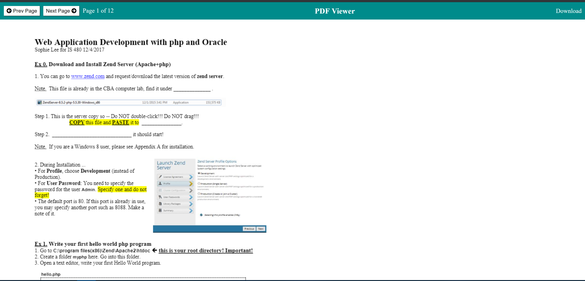

# PDF VIEWER

Application uses Mozilla's PDF.js to create an in-browser PDF document viewer.

The application renders one page at a time and allows you to click through the whole document. 
Also, the application allows you to download the document.

## To-Do List
- Make mobile responsive

- Add download link dynamic

- ~~Add error message when there is no pdf document available~~

## Screenshot
